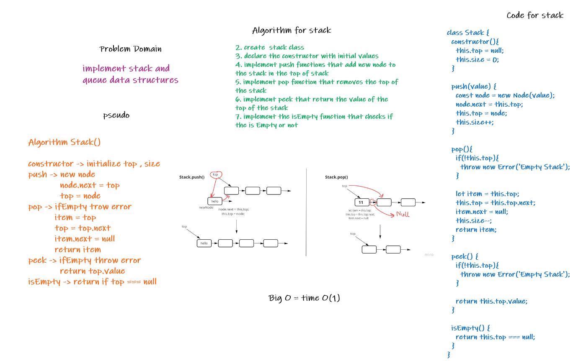
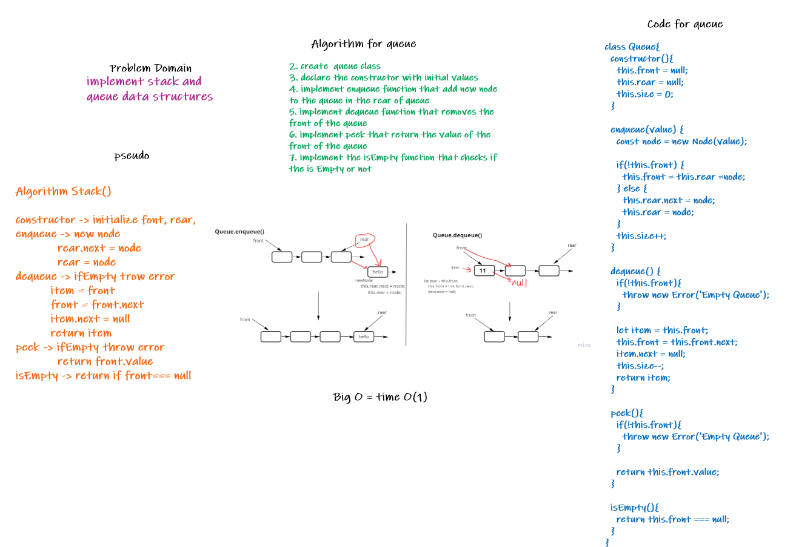

# Stack & Queue

Stack : It's a data structure that contain nodes. Each Node points to the next Node, but does not points to its previous.
Queue : same as Stack, but use FIFO(First In First Out) and LILO(Last In Last Out) concepts

## Challenge

Implement Stack & Queue data structure, which the user can push into the stack, and enqueue into the queue
remove an element from stack, dequeue from the queue, peek into the stack and the queue

## Approach & Efficiency
<!-- What approach did you take? Why? What is the Big O space/time for this approach? -->
I used classes to implement the stack and Queue , add some methods
for stack :

- push -> O(1)
- pop -> O(1)
- peek -> O(1)
- isEmpty -> O(1)

for Queue :

- enqueue -> O(1)
- dequeue -> O(1)
- peek -> O(1)
- isEmpty -> O(1)

## API
<!-- Description of each method publicly available to your Linked List -->
push -> if the stack is empty it will assign the value to the top node
pop -> will remove the value of the top of the stack, throw error if the stack is empty
peek -> will return the value of the top of the stack, throw error if the stack is empty.
isEmpty -> return true if the stack is empty otherwise returm false

enqueue -> if the queue is empty will assign the front and the raer to the new node
dequeue -> will remove the front node in the queue, throw error if the stack is empty.
peek -> will return the value of the front of the stack, throw error if the stack is empty.
isEmpty -> return true if the queue is empty otherwise returm false

