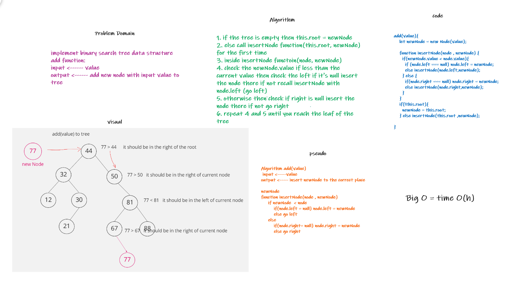
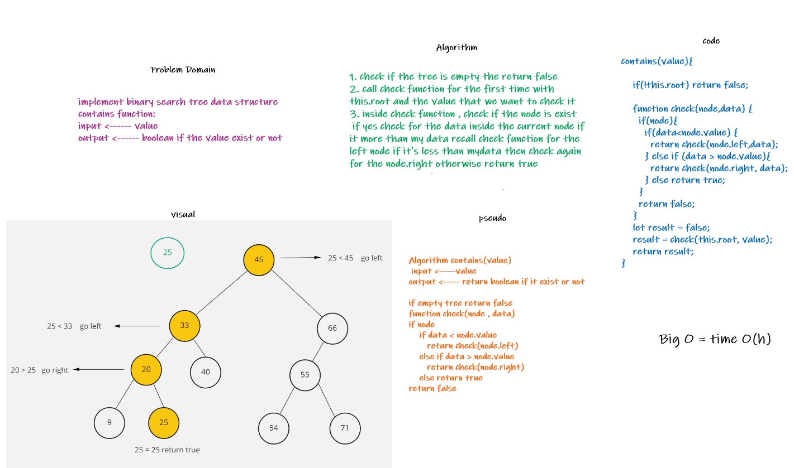

# Binary Tree & Binary Search Tree

Binary Tree : It's a data structure that contain nodes. Each Node maximum points to two children.

Binary Search Tree : same as binary tree, but iy should be ordered.

## Challenge

Implement Binary Tree & Binary Search Tree data structures, which the user can traverse into binary tree using pre-order, in-order or post-order
add into binary search tree and check if the specific value contains in the tree

## Approach & Efficiency
<!-- What approach did you take? Why? What is the Big O space/time for this approach? -->
I used classes to implement the Binary Tree and Binary Search Tree , add some methods
for Binary Tree :

- pre-order -> O(n)
- in-order -> O(n)
- post-order -> O(n)
- findMaximumValue -> O(n)

for Binary Search Tree :

- add -> O(log(n))
- contains -> O(log(n))

