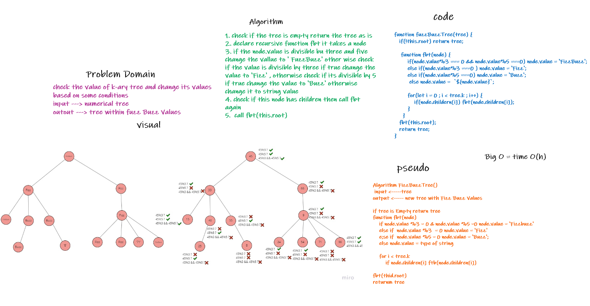

# Fizz Buzz Tree

## Challenge
<!-- Description of the challenge -->
Write a function that return a new tree with FizzBuzz values based on the value of the node

## Approach & Efficiency
<!-- What approach did you take? Why? What is the Big O space/time for this approach? -->
The function takes atree as argument then check the tree , if it's empty return it
if not create a new function claads fbt to traverse into the tree , it takes a node as argument
inside this function will check if the value of the node is divisible by three and five if yes change it to 'FizzBuzz'
otherwise check it if divisible by 3 only if yes change the vlaue to 'Fizz'
otherwise check if the node divisible by 5 if yes change it to 'Buzz'
otherwise change the same value to thr string type

## Solution
<!-- Embedded whiteboard image -->

